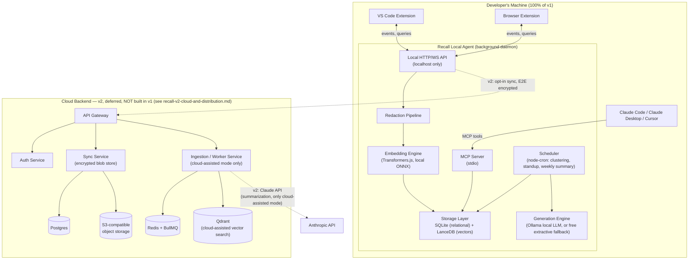

# Recall — Personal Developer Memory System
## Product Requirements Document & Technical Architecture Specification

**Version:** 1.3
**Status:** Ready for implementation
**Audience:** This document is written to be handed directly to an autonomous AI coding assistant (e.g. Claude Code) as the source of truth for implementation. Every section that contains a "MUST / SHALL" is a hard requirement. Sections marked "SHOULD" are strong defaults that can be revisited. Sections marked "Future / Out of scope for v1" must not be built in the initial implementation passes.

### Revision History
| Version | Date | Summary |
|---|---|---|
| 1.0 | 2026-07-01 | Initial PRD + architecture specification. |
| 1.1 | 2026-07-01 | Architecture-review pass before implementation. Reconciled at-rest encryption with the actual storage stack (§9, §7.5, §10); added a **local capability token** for the loopback API and an explicit **threat model** (§6.6, §8.1, §10); specified sync **merge semantics (LWW via `rev`), tombstones, and local/cloud embedding-model parity** (§6.4, §7, Phases 8–9); added **schema + embedding versioning/migration** (§7.6); added an **agent lifecycle / singleton** model (§6.7); consolidated **non-functional requirements & a daemon resource budget** (§5A); added MV3 durable-queue and storage-retention requirements (§13, §7.5); annotated MCP tool schemas as illustrative shorthand (§8.2). |
| 1.2 | 2026-07-01 | **v1 is now scoped to be zero-cost to build, host, and distribute.** Everything that requires a paid cloud service (backend hosting, managed Postgres/Redis/Qdrant, the Anthropic API) or a paid distribution channel (Chrome Web Store's one-time developer fee) is moved out of the v1 build entirely and captured in a companion document, [`recall-v2-cloud-and-distribution.md`](./recall-v2-cloud-and-distribution.md), to be picked up as v2. v1 remains fully functional without any of it — local capture, search, generation (via free local Ollama or the always-available extractive fallback), and MCP all work with zero network calls and zero recurring cost. Sections below are annotated inline wherever they referenced deferred scope; no local-only requirement changed. |
| 1.3 | 2026-07-01 | **UX & discoverability pass, driven by dogfooding the packaged `.vsix`** rather than by new functional scope. Real usage of the installed VS Code extension surfaced that its best features (Ask Recall, Daily Standup, Weekly Summary) were Command-Palette-only and effectively undiscoverable, that passive capture gave zero visible confirmation anything was happening, and that the Marketplace listing had no README, no icon field, and only a generic placeholder activity-bar icon. Added **Phase 2.5 — UX & discoverability polish (retroactive)** (§13) and **FR-30/FR-31/FR-32** (§4) to make this an explicit, re-checkable requirement rather than an implicit assumption. No architecture, data model, or API contract changed. |

---

## 0. How to use this document

1. Treat **Section 13 (Implementation Roadmap)** as the execution plan. Work phase by phase, in order. Do not skip ahead to later phases before a phase's Definition of Done is met.
2. Treat **Section 7 (Data Model)**, **Section 8 (API Contracts)**, and **Section 6 (Architecture)** as the contracts that all phases must conform to. If an implementation detail conflicts with this document, this document wins — flag the conflict instead of silently deviating.
3. Treat **Section 9 (Tech Stack Decision Matrix)** as fixed unless a chosen library is found to be genuinely unworkable, in which case document the substitution and why.
4. Section 12 (Monorepo Layout) is the exact folder structure to create in Phase 0. Do not invent a different layout.
5. This is a v1 / MVP-toward-scale spec. Anything marked "Future" should be stubbed (interfaces/types may exist) but not implemented.
6. **v1 MUST be buildable, runnable, and distributable at zero cost** — no paid cloud hosting, no paid third-party API usage (including the Anthropic API), no paid app-store listing fees. Anything that requires spending money is out of scope for v1 and lives instead in the companion document [`recall-v2-cloud-and-distribution.md`](./recall-v2-cloud-and-distribution.md). Where this document still describes that deferred scope (for architectural forward-compatibility, e.g. §6.4's merge semantics), it is documentation of a design constraint the local-only v1 must not preclude — not an instruction to build it now.

---

## 1. Problem Statement & Vision

Senior developers accumulate years of tacit knowledge — debugging insights, architectural lessons, API quirks, "why we don't do it that way," workarounds for vendor bugs, postmortem lessons. Almost none of it is captured anywhere durable. It lives in someone's head until they switch jobs, get promoted away from the code, or simply forget. Today, this knowledge gets *transmitted* mostly as a side effect of junior engineers doing real implementation work under supervision — code review, pairing, debugging together. As AI assistants absorb more of that implementation work, that transmission mechanism shrinks, and organizations risk losing the next generation's path to expertise *and* losing the current generation's expertise the moment someone leaves.

**Recall** is a personal, private, local-first memory system for developers. It runs quietly in the background across the IDE and the browser, captures the *process* of solving problems (not just the final commit), organizes that into a searchable personal knowledge base, and resurfaces relevant past reasoning exactly when it's useful again. It also produces derivative artifacts a developer already has to produce manually today — standups, retros, "what did I learn this week" — as a byproduct of capture rather than additional work.

**Strategic bet (2–3 year horizon):** as AI absorbs more raw implementation work, the scarce resource shifts to judgment, taste, and debugging instinct — i.e., to the things a senior developer "just knows." Recall is the system that makes that knowledge durable, portable, and queryable, both by the developer themselves and by AI coding agents acting on their behalf (via MCP).

### 1.1 Why this is defensible / sticky
- It is a **personal data moat**: the longer someone uses it, the more irreplaceable their own archive becomes. Nobody voluntarily deletes their own brain.
- It is **local-first by default**: trust is the adoption bottleneck for anything that watches your IDE and browser. Privacy cannot be a feature flag added later — it must be the architecture from day one.
- It composes with the AI-coding-agent ecosystem rather than competing with it: Recall is the memory layer that Claude Code / Cursor / Copilot can query via MCP, not a replacement for them.

---

## 2. Goals and Non-Goals

### 2.1 Goals (v1)
- G1: Passively capture high-signal developer activity from the IDE (VS Code) and the browser with near-zero manual effort.
- G2: Store all captured data **locally by default**, encrypted at rest, with no network calls unless the user explicitly opts in to sync.
- G3: Turn raw captured events into a searchable, semantically-indexed personal knowledge base ("memory").
- G4: Resurface relevant past memories proactively, in-context, while the developer is working (not just on explicit search).
- G5: Auto-generate a daily standup draft and a weekly learning summary from captured activity.
- G6: Expose the personal knowledge base to AI agents via a standard protocol (MCP), so tools like Claude Code can use a developer's own past reasoning as context.
- G7: Make privacy controls visible, granular, and trustworthy (pause capture, redact secrets, per-project/per-domain opt-out, full export, full delete).
- G8: Design the local data model so that an *optional* multi-device sync tier and a *future* team tier can be added later without re-architecting or migrating existing local data — without building or paying for any of that tier in v1 (see G9 and NG6).
- G9: **v1 MUST run entirely free of recurring or usage-based cost.** No cloud hosting bill, no paid API usage (including the Anthropic API), no paid distribution fee is required to build, run, or ship v1. Every AI feature has a free local path (Transformers.js embeddings, Ollama or the extractive fallback for generation) that a user never has to pay for.

### 2.2 Non-Goals (v1)
- NG1: Recall is not a team knowledge base / wiki replacement in v1. Multi-user shared knowledge graphs are future scope.
- NG2: Recall does not aim to capture 100% of browsing history — only developer-relevant activity, and only on an allowlist/heuristic basis, never a blanket history dump.
- NG3: Recall is not an AI pair-programmer. It does not write code. It supplies *context* to the developer and to other coding agents.
- NG4: Recall does not attempt real-time screen recording, keystroke logging, or audio/video capture.
- NG5: v1 does not include IDEs other than VS Code. (Architecture must not preclude JetBrains/Neovim later — see Section 6.5.)
- NG6: **v1 does not include any cloud-hosted component or any paid distribution channel.** No auth/sync backend, no cloud-assisted search, no Anthropic API integration, and no Chrome Web Store submission (which carries a one-time developer registration fee) are built or required for v1. All of this is fully specified for later pickup in [`recall-v2-cloud-and-distribution.md`](./recall-v2-cloud-and-distribution.md), not abandoned — just deliberately out of scope until the free local product has proven itself.

### 2.3 Success Metrics
- Activation: % of installs that reach "first surfaced memory accepted as useful" within 7 days.
- Retention: weekly active capture rate at week 4, week 12.
- Standup quality: % of generated daily standups copied/used with zero or minor edits.
- Trust: % of users who never disable capture vs. % who pause it within first week (signal on whether defaults feel safe).
- Recall quality: thumbs-up rate on surfaced "related memory" suggestions.

---

## 3. Personas

- **P1 — Senior IC ("Priya")**: 8 years experience, deep in 3 codebases, constantly context-switches between projects. Wants her own debugging history searchable instead of re-solving the same CORS/auth/flaky-test issue every few months.
- **P2 — New hire ramping ("Diego")**: 3 months into a new codebase. Wants standup generation to reduce overhead and wants surfaced context ("you looked at this file last on Tuesday, here's what you found") while ramping.
- **P3 — Engineering manager (secondary persona, future)**: wants aggregate, anonymized team learning trends. Out of scope for v1 but should not be architecturally precluded (see multi-tenant note in Section 6.4).

---

## 4. Core User Journeys (v1)

1. **Silent capture**: Priya debugs a flaky integration test for 40 minutes — runs terminal commands, edits 3 files, hits a breakpoint, searches "jest timeout exceeded" in the browser, finds a Stack Overflow answer, fixes it. Recall silently captures this as a cluster of related events with zero manual action required.
2. **In-context resurfacing**: Two months later, Diego hits a similar flaky-test error. While he has the failing test open, Recall's VS Code panel surfaces "Priya-you solved something like this on Mar 14 — `jest.setTimeout` + async leak in teardown" with a link to jump to the original commit/terminal output.
3. **Explicit ask**: Priya types `Recall: Ask my memory` and asks "how did I configure the staging DB connection pool last time," gets a synthesized answer with citations back to the original captured terminal sessions/files.
4. **Daily standup**: Each morning, Recall has a draft standup ready in the sidebar: "Yesterday: debugged flaky CI test (resolved), started OAuth refactor (in progress), reviewed PR #482." One click to copy to Slack.
5. **Weekly learning summary**: Every Friday, a generated summary: "This week you worked across 3 repos, resolved 4 distinct bug patterns, and your search activity suggests growing depth in distributed tracing."
6. **MCP-powered agent context**: Priya asks Claude Code to "fix the same kind of timeout issue we hit before" — Claude Code calls Recall's MCP `search_memory` tool and gets her own prior fix as grounding context.
7. **Privacy control**: Diego is debugging something containing a customer's PII in logs. He hits "pause capture" from the status bar before pasting it into the terminal, and later reviews exactly what was captured that week and deletes anything he doesn't want kept.

---

## 5. Functional Requirements

### 5.1 Capture (MUST)
- FR-1: Capture VS Code terminal command executions (command text, cwd, exit code, truncated output) using the VS Code Shell Integration API.
- FR-2: Capture file save events with a **diff** (not full file content) against the previous saved version, plus language id and project/repo identifier.
- FR-3: Capture debug session lifecycle (start/end, launch config name, exceptions raised, and on user-triggered "capture this debug session" command, the call stack / variables at time of an exception).
- FR-4: Capture Git activity (commits with message + changed file list + diff stat, branch switches) via the built-in Git extension API.
- FR-5: Capture diagnostics transitions (a file going from N errors to 0 errors is a strong "problem resolved" signal) via `vscode.languages.onDidChangeDiagnostics`.
- FR-6: Capture task/build/test run results (`vscode.tasks.onDidEndTaskProcess`), including pass/fail and exit code.
- FR-7: Provide an explicit manual capture command (`Recall: Save as memory`) for anything the passive capture misses, with optional free-text annotation and tags.
- FR-8: Browser extension MUST capture, only on allowlisted/heuristically-classified developer domains (docs sites, Stack Overflow/Stack Exchange family, GitHub, GitLab, MDN, package registries, RFC/spec sites, internal docs the user explicitly allowlists): page visits (URL, title, canonical link, timestamp, dwell time), search queries issued on those domains, and explicit "save selection to Recall" via context menu.
- FR-9: Browser extension MUST NOT capture page content text beyond a short auto-generated summary/snippet, and MUST NOT run on non-allowlisted domains by default.
- FR-10: All capture sources funnel into one normalized `MemoryEvent` schema (Section 7.1) before storage.

### 5.2 Redaction (MUST)
- FR-11: Before any event payload is persisted or embedded, it MUST pass through a redaction pipeline that strips likely secrets: high-entropy tokens, strings matching common API key/JWT/private-key patterns, `.env`-style `KEY=VALUE` secrets, and credentials in URLs.
- FR-12: The user MUST be able to test the redaction pipeline against arbitrary pasted text via a command, to build trust.
- FR-13: Redaction must run locally and must never be skipped for cloud-sync payloads (defense in depth, even though sync payloads are also client-side encrypted).

### 5.3 Knowledge Organization (MUST)
- FR-14: Raw `MemoryEvent`s MUST be embedded (vector representation of a normalized text rendering of the event) for semantic search.
- FR-15: A background clustering/synthesis job MUST periodically group related `MemoryEvent`s (same error signature, same files, same time window, same search-then-fix pattern) into a higher-level `Lesson` entity with an LLM-generated title, summary, and "what worked" / "what didn't" fields.
- FR-16: Both raw events and synthesized `Lesson`s MUST be searchable.

### 5.4 Retrieval & Surfacing (MUST)
- FR-17: A hybrid search (vector similarity + keyword/FTS + recency + tag filters) MUST be available via API, VS Code command, and MCP tool.
- FR-18: Recall MUST proactively surface relevant memories in the VS Code sidebar based on the developer's current context (open file, current error/diagnostic, recent terminal failure) without an explicit query, refreshed as context changes (debounced).
- FR-19: An "Ask Recall" RAG flow MUST retrieve top-k relevant memories and produce a synthesized natural-language answer with citations (clickable links back to the originating file/terminal/commit/page).

### 5.5 Generation (MUST)
- FR-20: Daily standup draft, generated on a schedule (default: on first VS Code activation each day) from the prior workday's events, editable before copy/export.
- FR-21: Weekly learning summary, generated every Friday (configurable), synthesized from the week's `Lesson`s and daily standups.
- FR-22: Skill evolution profile: a longitudinal, locally-computed aggregation of tags/technologies/problem-types encountered over time (frequency + recency-weighted), exposed via API/MCP and (future) a dashboard visualization.

### 5.6 MCP Integration (MUST)
- FR-23: Recall MUST expose an MCP server (stdio transport for local single-user use) with at minimum the tools: `search_memory`, `get_recent_context`, `save_memory`, `get_daily_standup`, `get_weekly_summary`, `get_skill_profile`.
- FR-24: The MCP server MUST be a mode of the same local agent process (not a separate reimplementation), so it shares one source of truth.

### 5.7 Privacy Controls (MUST)
- FR-25: A single, fast "pause capture" control reachable from the VS Code status bar and the browser extension toolbar icon, pausing both surfaces in sync.
- FR-26: Per-project capture opt-out in VS Code; per-domain capture opt-out in the browser extension.
- FR-27: Full local data export (JSON) and full local data wipe, both single-command operations.
- FR-28: Cloud sync is OFF by default and **not implemented at all in v1** (§6.4 describes the design so the local schema doesn't need to change later — see [`recall-v2-cloud-and-distribution.md`](./recall-v2-cloud-and-distribution.md) for the actual build). Whenever it is built, enabling it requires an explicit, separate opt-in, with a clear explanation of what "zero-knowledge backup" vs "cloud-assisted search" mode means.

### 5.8 Onboarding (SHOULD)
- FR-29: First-run walkthrough (VS Code Walkthrough API) explaining what is captured, where it's stored, and how to pause/redact, before any background capture begins. The walkthrough MUST include at least one actionable step tied to a real command via `completionEvents` (e.g. "Try Ask Recall"), not purely descriptive steps — a user should complete the walkthrough having actually used the tool once, not just read about it.
- FR-30: Every command that is part of the tool's core value loop (Ask Recall, Daily Standup, Weekly Summary — and Save as Memory / Test Redaction as secondary actions) MUST be reachable from the VS Code sidebar's `view/title` menu, not the Command Palette alone. A first-time user should never need to know an exact command name to discover what Recall can do.
- FR-31: The VS Code sidebar MUST show an explanatory empty state (via `contributes.viewsWelcome`) before any memories exist, linking directly to the commands that produce the first one (Ask Recall, Save as Memory) — not a blank panel.
- FR-32: The VS Code extension's Marketplace listing MUST have a `README.md` describing the value proposition and naming its key features, and a real (non-placeholder) icon set via `package.json`'s `"icon"` field — a user's first impression of the tool is the Marketplace/Extensions view, before install, not just the in-editor walkthrough after.

---

## 5A. Non-Functional Requirements

These consolidate the performance/resource targets referenced throughout the document. They are budgets, not aspirations — Phase DoDs that touch these paths MUST measure against them.

### 5A.1 Latency budgets (local, P95, on a mid-range 2021-era laptop)
| Operation | Target | Notes |
|---|---|---|
| Proactive surfacing `/v1/context/related` | < 150 ms | Runs on every debounced editor/diagnostic/terminal trigger; must not cause perceptible IDE lag (§11.3). |
| Hybrid search `/v1/search` | < 300 ms | Corpus of 1,000 events (§13 Phase 3 DoD). |
| Event ingest `/v1/events` (excluding async embedding) | < 50 ms | Redaction + write must be fast; embedding is queued, not inline (§11.1). |
| `/v1/health` | < 20 ms | Polled by the VS Code extension to decide whether to spawn the agent. |
| RAG `/v1/ask` (local Ollama) | best-effort | Bounded by the local model; show a streaming/typing state, no hard budget. |

### 5A.2 Resource budget for the Local Agent daemon
The agent runs continuously in the background; it MUST be a good citizen.
- **Idle:** < 1% sustained CPU and < 150 MB RSS when no capture/embedding/generation is in flight. Embedding/generation work runs in a bounded worker pool, not on the request thread.
- **Active embedding:** capped concurrency (default 1–2 workers); embedding is debounced to save/commit/command-finish boundaries (never per-keystroke).
- **On battery:** SHOULD defer non-urgent background jobs (clustering, weekly summary) and reduce embedding concurrency when the OS reports the device is on battery / in power-save.
- **Disk:** see storage-retention requirement NFR-RET below.
- **Startup:** cold start to "ready" (`/v1/health` OK) in < 3 s, excluding first-ever model download.

### 5A.3 Reliability
- NFR-REL-1: Loss of any AI dependency (Ollama, cloud key, network) MUST degrade gracefully, never crash the agent or block capture (§6.1 principle 4).
- NFR-REL-2: Capture MUST be durable across process/service-worker restarts: unsent events are queued on disk (Local Agent) or in IndexedDB (browser, §13 Phase 5) and retried, not dropped.

### 5A.4 Storage growth (NFR-RET)
- NFR-RET-1: Event payloads and diffs accumulate indefinitely; v1 MUST NOT grow without bound silently. Provide a configurable retention policy (default: keep raw events indefinitely, but expose a "compact/forget events older than N days that are unpinned and not cited by a `Lesson`" maintenance command). Recency decay (§11.2) only affects ranking, not size.
- NFR-RET-2: Because LanceDB is append/segment-based, true deletes (SEC-7) MUST be followed by segment compaction so freed space is actually reclaimed and deleted vectors are not recoverable from old segments.

---

## 6. System Architecture

### 6.1 Architectural principles
1. **Local-first, cloud-optional.** The full product MUST function with zero network access. Cloud sync is an enhancement, never a dependency.
2. **One brain, many surfaces.** The VS Code extension and the browser extension are both thin clients of a single local process (the **Recall Local Agent**) that owns storage, embeddings, redaction, and generation. This avoids duplicated logic and divergent local databases.
3. **Normalize early.** Every capture surface converts its raw signal into the same `MemoryEvent` shape immediately, so storage/search/generation code never needs to know which surface an event came from.
4. **Graceful degradation.** No external dependency (Ollama, a cloud LLM key, network connectivity) should be a hard requirement; each AI-dependent feature must have a fallback (extractive summarization, keyword search) if the preferred provider is unavailable.
5. **Same contracts, local or cloud.** The local agent's API and the cloud backend's sync API are designed so the same `MemoryEvent`/`Lesson` schemas flow through both — no separate "cloud schema."

### 6.2 High-level diagram

**v1 builds only the "Developer's Machine" subgraph below — no network calls, no cloud service, no cost.** The `Cloud Backend` subgraph (and the Anthropic API dependency inside it) is entirely deferred to v2; its full diagram, component responsibilities, and tech stack now live in [`recall-v2-cloud-and-distribution.md`](./recall-v2-cloud-and-distribution.md) so this document stays an accurate description of what's actually being built.



### 6.3 Component responsibilities

| Component | Responsibility | Runs where |
|---|---|---|
| VS Code Extension | Capture IDE signals, render sidebar/CodeLens/status bar, talk to Local Agent | Inside VS Code's extension host |
| Browser Extension | Capture allowlisted browsing signals, popup controls, talk to Local Agent | Browser background service worker |
| Recall Local Agent | Single source of truth: storage, redaction, embeddings, retrieval, generation, scheduling, MCP server | Background process on dev machine |
| MCP Server (mode of Local Agent) | Expose memory to external AI agents over MCP | stdio (spawned by Claude Desktop/Code config) or local HTTP+SSE |

The four cloud components (API Gateway, Auth Service, Sync Service, Ingestion/Worker Service) are **v2 scope, not built in v1** — see [`recall-v2-cloud-and-distribution.md`](./recall-v2-cloud-and-distribution.md) for their responsibilities.

### 6.4 Sync modes (cloud, both opt-in, OFF by default, **v2 — not built in v1**)

Full detail on both modes now lives in [`recall-v2-cloud-and-distribution.md`](./recall-v2-cloud-and-distribution.md). Summarized here only because it shapes the local data model that v1 *does* build (§6.4.1, §7): two distinct modes, never conflated, both requiring their own explicit opt-in — **Encrypted Backup & Multi-Device Merge** (zero-knowledge, client-side encrypted) and **Cloud-Assisted Search** (non-zero-knowledge, requires the Anthropic API and a hosted Qdrant, and is therefore the one with a real recurring cost). Neither exists as working code in v1; the `syncOptIns` fields in `Settings` (§7) exist today only so the schema doesn't need a breaking migration once v2 implements them.

#### 6.4.1 Merge semantics (both sync modes)
- **Identity & immutability.** `MemoryEvent`s are append-only and immutable once written (their `id` is a ULID, which is time-sortable). They never conflict; sync is a set-union by `id`.
- **Mutable records** (`Lesson`, settings, tags, `usefulnessScore`, `privacy` flags) use **last-writer-wins keyed on a monotonic `rev` counter**, not on wall-clock `updatedAt` (clocks skew across devices). Each mutation increments `rev`; on conflict the higher `rev` wins, ties broken by `deviceId`. `updatedAt` is retained for display only. See `rev` in §7.
- **Deletes use tombstones.** A delete writes a tombstone `{ id, deletedAt, deletedBy }` that propagates like any other record so other devices remove the data on pull (without a tombstone, a pull would resurrect deleted rows). To honor SEC-7 (true delete), tombstones carry no payload, and are themselves garbage-collected once all known devices have acknowledged the cursor past them.
- **Embedding parity.** Vectors are only comparable if produced by the same model + dimensionality. Local and Cloud-Assisted indexes MUST use the **same embedding model and dimension** (recorded per vector, §7.6); if they differ, the cloud side re-embeds from `embeddingText` rather than trusting an incompatible vector.

### 6.5 Forward-compatibility (not built in v1, must not be precluded)
- Other IDEs (JetBrains/Neovim) should be addable as additional thin clients of the same Local Agent API — do not bake any VS Code-specific assumption into the Local Agent's public API.
- Team tier: every row created in the cloud backend MUST already carry a `tenant_id` (defaulting to a personal/single-user tenant in v1), so a future team knowledge graph doesn't require a migration of historical data.

### 6.6 Threat model
The security requirements in §10 exist to counter specific adversaries. v1 designs against:

| Adversary | Capability | Primary mitigations |
|---|---|---|
| **Malicious / curious local process** (other app on the same machine) | Can attempt to connect to the Local Agent's loopback port and read captured memory | Loopback-only bind (SEC-4) **+ per-install capability token** required on every request (§8.1); token stored in OS keychain, not world-readable config. |
| **Malicious webpage** in the user's browser | Can issue `fetch`/WebSocket to `http://127.0.0.1:<port>` and attempt DNS-rebinding; `Origin` is not always sent | Capability token (unknown to arbitrary pages) **+** `Host`/`Origin` allowlist **+** reject requests lacking the token. The token is the real boundary; Origin checks are defense-in-depth only. |
| **Honest-but-curious cloud** (Encrypted Backup mode — **v2, not built in v1**) | Sees all uploaded blobs + metadata | Client-side XChaCha20-Poly1305; key never transmitted (SEC-5). Server stores ciphertext + merge metadata only. Not applicable until v2 ships this mode — see [`recall-v2-cloud-and-distribution.md`](./recall-v2-cloud-and-distribution.md). |
| **Cloud operator** (Cloud-Assisted mode — **v2, not built in v1**) | Sees post-redaction plaintext the user explicitly chose to send | Out of zero-knowledge scope by design; gated behind a distinct second opt-in (SEC-6) and redaction (FR-11). Not applicable until v2 ships this mode. |
| **Lost / stolen device** | Physical access to disk and possibly an unlocked session | At-rest protection per §10 (OS full-disk encryption as the baseline + keychain-bound app key); "pause/lock" does not protect an already-unlocked machine. Stated honestly so users aren't misled. |
| **Accidental secret capture** | Secrets pasted into terminal/logs/pages | Redaction pipeline before persist *and* before embed (SEC-3); user-testable (FR-12); audit log (SEC-8). |

Explicitly **out of scope** for v1: a malicious VS Code/browser extension already running with the user's privileges (it can read the token), kernel/root-level attackers, and side-channel attacks.

### 6.7 Local Agent lifecycle & single-instance ownership
The agent is a singleton per user data directory, but several surfaces may try to start it (multiple VS Code windows, browser-only use, the CLI). Lifecycle rules:
- **Single instance:** the agent acquires an exclusive lock on `~/.recall/agent.lock` at startup. A second instance that fails to acquire the lock exits and defers to the running one.
- **Discovery:** on successful start the agent writes `~/.recall/agent.json` `{ port, pid, token, startedAt, version }` (file permissions `0600`). The VS Code extension and browser extension read this file to find the port and capability token instead of assuming a fixed port.
- **Port selection:** default `47811`; if taken, bind the next free port and record it in `agent.json`. Clients MUST read the discovery file, not hardcode the port.
- **Ownership / supervision:** the VS Code extension spawns the agent as a **detached** child (so it survives the window closing) and health-checks it; it does not kill an agent another window/CLI may still be using. Browser-only users start it via `recall-agent start` (documented in Phase 5/11).
- **Shutdown:** the agent stops on explicit `recall-agent stop` or when idle with no connected clients for a configurable grace period (default: stays resident; opt-in auto-stop). Lock and discovery files are removed on clean exit and treated as stale (pid not alive) on next start.

---

## 7. Data Model

### 7.1 `MemoryEvent` (canonical capture unit)

```ts
type MemorySource = "vscode" | "browser" | "manual";

type MemoryEventType =
  | "terminal_command"
  | "file_edit"
  | "debug_session"
  | "git_commit"
  | "branch_switch"
  | "diagnostic_resolved"
  | "task_run"
  | "search_query"
  | "page_visit"
  | "manual_note";

interface MemoryEvent {
  id: string;                    // ulid (time-sortable; doubles as creation-order key)
  schemaVersion: number;         // record schema version, for migrations (§7.6)
  rev: number;                   // monotonic, incremented on every mutation; LWW key for sync (§6.4.1)
  tenantId: string;              // defaults to local single-user tenant
  deviceId: string;
  source: MemorySource;
  type: MemoryEventType;
  occurredAt: string;            // ISO 8601 (event time)
  updatedAt: string;             // ISO 8601 (last mutation; display only — NOT used for conflict resolution)
  project?: {
    repoRoot?: string;
    repoRemoteUrl?: string;      // normalized, no credentials
    branch?: string;
  };
  context?: {
    filePath?: string;
    language?: string;
    url?: string;                // browser source only
  };
  payload: Record<string, unknown>;   // type-specific structured data, post-redaction
  embeddingText: string;         // normalized text used to generate the embedding
  embedding?: number[];          // populated async after redaction
  embeddingModel?: string;       // e.g. "all-MiniLM-L6-v2"; vectors comparable only within the same model+dim (§7.6, §6.4.1)
  embeddingDim?: number;         // e.g. 384
  tags: string[];                // auto + manual
  links: string[];               // related MemoryEvent / Lesson ids
  redacted: boolean;
  privacy: {
    pinned: boolean;             // user marked "never auto-delete / always searchable"
    excludedFromSync: boolean;
  };
}
```

> **Deletes are tombstoned, not destructive in-place.** A delete is represented by a separate tombstone record (`{ id, deletedAt, deletedBy, tenantId }`) plus removal of the underlying row/vector, so the delete propagates across devices (§6.4.1) while still being a true delete locally (SEC-7). The same `rev`/`schemaVersion`/`embeddingModel` conventions apply to `Lesson` (§7.2).

Type-specific `payload` shapes (examples, not exhaustive):

```ts
// terminal_command
{ command: string; cwd: string; exitCode: number; outputExcerpt: string }

// file_edit
{ diff: string; addedLines: number; removedLines: number }

// debug_session
{ launchConfigName: string; exceptions?: { message: string; stack: string }[] }

// git_commit
{ sha: string; message: string; filesChanged: string[]; diffStat: string }

// search_query (browser)
{ engineOrSite: string; query: string }

// page_visit (browser)
{ title: string; canonicalUrl: string; dwellMs: number; autoSummary?: string }
```

### 7.2 `Lesson` (synthesized knowledge unit)

```ts
interface Lesson {
  id: string;
  schemaVersion: number;         // §7.6
  rev: number;                   // LWW key for sync (§6.4.1) — Lessons are mutable
  tenantId: string;
  title: string;                 // LLM-generated, e.g. "Flaky Jest tests from async teardown leaks"
  summary: string;               // LLM-generated synthesis
  whatWorked?: string;
  whatDidntWork?: string;
  sourceEventIds: string[];      // provenance — always link back to raw MemoryEvents
  tags: string[];
  embedding: number[];
  embeddingModel: string;        // model+dim that produced `embedding` (§7.6, §6.4.1)
  embeddingDim: number;
  project?: { repoRoot?: string };
  createdAt: string;
  updatedAt: string;             // display only — not a conflict-resolution key
  usefulnessScore: number;       // updated by user feedback (thumbs up/down on surfacing)
}
```

### 7.3 `DailyStandup` / `WeeklySummary`

```ts
interface DailyStandup {
  id: string;
  date: string;           // YYYY-MM-DD
  generatedAt: string;
  draftText: string;      // editable by user
  finalText?: string;     // what user actually copied/exported, if edited
  sourceEventIds: string[];
}

interface WeeklySummary {
  id: string;
  weekOf: string;          // YYYY-MM-DD (Monday)
  generatedAt: string;
  draftText: string;
  highlightedLessonIds: string[];
}
```

### 7.4 `SkillProfile`

```ts
interface SkillProfile {
  tenantId: string;
  updatedAt: string;
  tagFrequencies: Record<string, { count: number; lastSeen: string; trend: "up" | "down" | "flat" }>;
  topLanguages: Record<string, number>;
  distinctProblemPatternsResolved: number;
}
```

### 7.5 Storage mapping
- **SQLite** owns: app settings, capture allowlists/denylists, audit log, sync state/cursors, **tombstones** (§6.4.1), `DailyStandup`/`WeeklySummary`/`SkillProfile` rows (no vector search needed on these), job schedule bookkeeping, and the data-directory `schemaVersion`.
- **LanceDB** (embedded, file-based) owns: `MemoryEvent` and `Lesson` records including their embedding columns, queried via vector similarity + metadata filters + full-text (Lance's integrated FTS) for hybrid search.
- Both live under a single per-user app-data directory, e.g. `~/.recall/`. **At-rest protection model (see §10 for the authoritative requirement):** neither stock `better-sqlite3` nor LanceDB provides transparent encryption, so v1 does NOT claim a bespoke encrypted database. Instead it relies on (a) OS full-disk encryption as the baseline, (b) the at-rest secrets (capability token, sync passphrase-derived key material) held in the OS keychain rather than on disk, and (c) optional application-level encryption of sensitive payload fields using a keychain-bound key. Discovery/lock files (`agent.json`, `agent.lock`) are written `0600`.
- **Retention/compaction:** see NFR-RET (§5A.4) — deletes must be followed by LanceDB segment compaction to reclaim space and make deleted vectors unrecoverable.

### 7.6 Schema & embedding versioning / migration
The data model and the embedding model both evolve; the on-disk format MUST be versioned so upgrades don't corrupt or silently mis-rank existing data.
- **Record schema version.** Every `MemoryEvent`/`Lesson` carries `schemaVersion`; the data directory records the current version. On agent start, run forward-only migrations (a numbered migration list for SQLite; a documented backfill routine for LanceDB columns) to bring records to the current version before serving requests.
- **Embedding model version.** Each vector records the `embeddingModel` + `embeddingDim` that produced it. Search MUST NOT mix vectors from different models. When the default embedding model is upgraded, existing vectors are flagged stale and re-embedded in the background from their stored `embeddingText`; until re-embedded, stale-model rows fall back to FTS/keyword ranking so search never returns silently-wrong neighbors.
- **Cloud parity (v2 — not applicable in v1, no Qdrant exists yet).** Cloud-Assisted Qdrant collections are keyed by `embeddingModel`/`embeddingDim`; a model mismatch triggers cloud-side re-embedding from `embeddingText` (§6.4.1), never a comparison of incompatible vectors.

---

## 8. API Contracts

### 8.1 Local Agent API (`http://127.0.0.1:<port>`, default `47811`, bound to localhost only)

| Method | Path | Purpose |
|---|---|---|
| POST | `/v1/events` | Ingest one `MemoryEvent` (pre-redaction payload; agent redacts) |
| POST | `/v1/events/batch` | Ingest multiple events (browser extension batches page visits) |
| GET | `/v1/search?q=&type=&project=&since=&limit=` | Hybrid search over `MemoryEvent` + `Lesson` |
| GET | `/v1/memories/:id` | Fetch one event or lesson by id |
| POST | `/v1/memories/:id/feedback` | `{ useful: boolean }` — feeds `usefulnessScore` / ranking |
| GET | `/v1/context/related?file=&errorText=` | Proactive surfacing query used by the VS Code sidebar |
| POST | `/v1/ask` | RAG endpoint: `{ question: string }` → `{ answer: string, citations: MemoryRef[] }` |
| GET | `/v1/standup?date=YYYY-MM-DD` | Fetch/generate daily standup |
| GET | `/v1/standup/weekly?week=YYYY-MM-DD` | Fetch/generate weekly summary |
| GET | `/v1/skill-profile` | Fetch skill profile |
| POST | `/v1/redaction/test` | `{ text: string }` → `{ redacted: string, findings: Finding[] }` |
| GET/POST | `/v1/settings` | Read/update local settings (allowlists, pause state, sync opt-ins) |
| POST | `/v1/capture/pause` / `/v1/capture/resume` | Global pause toggle |
| GET | `/v1/health` | Liveness/readiness, used by VS Code extension to know if it must spawn the agent |
| WS | `/v1/stream` | Server push: "new relevant memory for current context," job completion events |

All request/response bodies use the schemas in Section 7. All endpoints are local-only.

**Authentication (local capability token).** Binding to loopback is *not* sufficient on its own: any process on the machine — and any webpage in the user's browser via `fetch`/WebSocket to `127.0.0.1` — can reach a loopback port, and the `Origin` header is not reliably present on such requests (and is bypassable via DNS rebinding). Therefore every request (HTTP and WS, except `/v1/health`) MUST carry a per-install **capability token** (`Authorization: Bearer <token>`, or a WS subprotocol/handshake field). The token is generated on first agent start, stored in the OS keychain, and published only to trusted clients through the `0600` discovery file `~/.recall/agent.json` (§6.7), which arbitrary webpages cannot read. The agent MUST:
- reject any non-loopback remote address (SEC-4),
- reject any request missing/with an invalid token (constant-time compare),
- enforce an `Origin`/`Host` allowlist as defense-in-depth.

The token is the real trust boundary (see threat model §6.6); loopback + Origin checks are secondary.

### 8.2 MCP Tools (exposed by `recall-agent mcp`)

> The `input_schema` blocks below are **illustrative shorthand** (`"field": "type"`), not literal JSON Schema. The implementation MUST emit valid JSON Schema per the MCP spec (`{ "type": "object", "properties": { ... }, "required": [ ... ] }`) so MCP clients can validate calls. Each tool SHOULD also document its return shape: `search_memory`/`get_recent_context` → an array of memory refs (`{ id, type, occurredAt, title|embeddingText, score }`); `save_memory` → the created memory `id`; `get_daily_standup`/`get_weekly_summary` → the corresponding §7.3 object; `get_skill_profile` → the §7.4 `SkillProfile`.

```json
{
  "tools": [
    {
      "name": "search_memory",
      "description": "Semantic + keyword search over the user's personal developer memory (past debugging sessions, notes, decisions).",
      "input_schema": { "query": "string", "project": "string?", "limit": "number?" }
    },
    {
      "name": "get_recent_context",
      "description": "Returns recent activity for a given project, useful as situational context.",
      "input_schema": { "project": "string?", "sinceHours": "number?" }
    },
    {
      "name": "save_memory",
      "description": "Explicitly save a note/insight into the user's personal memory.",
      "input_schema": { "content": "string", "tags": "string[]?" }
    },
    {
      "name": "get_daily_standup",
      "input_schema": { "date": "string?" }
    },
    {
      "name": "get_weekly_summary",
      "input_schema": { "week": "string?" }
    },
    {
      "name": "get_skill_profile",
      "input_schema": {}
    }
  ]
}
```

### 8.3 Cloud Backend API — **v2, moved out of this document**

The cloud backend's API contract (auth, device pairing, sync push/pull, cloud-assisted search) is entirely v2 scope and now lives in [`recall-v2-cloud-and-distribution.md`](./recall-v2-cloud-and-distribution.md) alongside the phases that implement it. Nothing in v1 calls or depends on it.

---

## 9. Tech Stack Decision Matrix

| Layer | Choice | Why |
|---|---|---|
| Language (everywhere) | TypeScript | One language across extension/agent/backend simplifies shared types and lets a single coding agent implement the whole stack consistently |
| Monorepo tooling | pnpm workspaces + Turborepo | Fast incremental builds, good for many small packages |
| VS Code Extension | VS Code Extension API, esbuild bundling | Standard, well-documented, supports Shell Integration & Debug APIs needed for capture |
| Browser Extension | Manifest V3, Vite + crxjs, `webextension-polyfill` | MV3 is required by current Chrome/Edge store policy; polyfill gives Firefox portability |
| Local Agent runtime | Node.js (20+) | Shares TS types with the rest of the stack; good ecosystem for embedding/LLM glue |
| Local relational store | SQLite via `better-sqlite3` | Zero-ops, embedded, fast, fine for settings/audit/standup rows. NOTE: stock `better-sqlite3` is unencrypted; if a bespoke encrypted DB is desired beyond the §10 baseline, substitute `better-sqlite3-multiple-ciphers` (SQLCipher). |
| Local vector store | LanceDB (`vectordb` npm package) | Embedded (no server), file-based, supports vector + metadata filter + FTS hybrid search — ideal for local-first |
| Local embeddings | Transformers.js running a quantized `all-MiniLM-L6-v2` ONNX model | Pure JS/WASM, no Python dependency, fully offline |
| Local summarization LLM | Ollama (auto-detected if installed; e.g. `phi3.5` or `llama3.2:3b`), else the always-available extractive fallback | Free, local, no data leaves device, no LLM installation even required |
| Process management for Local Agent | Spawned/supervised by VS Code extension via `child_process`; standalone CLI for browser-only use | Avoids requiring a separate installer for the common case |
| MCP SDK | `@modelcontextprotocol/sdk` (TypeScript), stdio transport | Standard, matches Claude Desktop/Code config conventions |
| Client-side encryption | libsodium (`libsodium-wrappers`) | Well-audited primitives for zero-knowledge sync — **v2 dependency only; not installed/used in v1** |
| Local at-rest protection | OS full-disk encryption (baseline) + secrets/keys in OS keychain (`keytar` / VS Code `SecretStorage`) + optional app-level field encryption (libsodium) for sensitive payloads | Neither LanceDB nor stock SQLite offers transparent encryption; this layered model is what actually delivers SEC-2 (see §7.5, §10). The capability token and sync key material live in the keychain, never in a plaintext config file. |
| CI/CD | GitHub Actions | Free tier is sufficient at this scale; matrix build for extension + agent |

**Everything cloud/paid is v2 scope, not part of the v1 tech stack**: the Anthropic API, NestJS backend, PostgreSQL, Qdrant, S3-compatible object storage, Redis + BullMQ, and any hosting platform (Fly.io/Render for the MVP tier, Kubernetes for scale) are fully specified in [`recall-v2-cloud-and-distribution.md`](./recall-v2-cloud-and-distribution.md) instead of here, so this table only lists what v1 actually depends on.

---

## 10. Security & Privacy Requirements

- SEC-1: No data leaves the device unless the user has explicitly enabled a sync mode (Section 6.4). This MUST be true even for crash/error reporting (opt-in, anonymized only, off by default).
- SEC-2: Local data at-rest protection MUST be implemented as a layered model, because the embedded stores (LanceDB, stock `better-sqlite3`) do not provide transparent database encryption: (a) OS full-disk encryption is the baseline expectation and MUST be documented to the user as the primary protection for a lost/stolen device; (b) all at-rest **secrets and key material** (capability token, sync passphrase-derived keys) MUST be held in the OS keychain (`keytar`/`SecretStorage`), never in a plaintext file; (c) sensitive payload fields SHOULD be encrypted application-side with a keychain-bound key (libsodium), and a fully-encrypted SQLite (SQLCipher via `better-sqlite3-multiple-ciphers`) MAY be substituted if a stronger guarantee than (a)+(b)+(c) is required. The document MUST NOT claim a guarantee the stack does not provide.
- SEC-3: The redaction pipeline (Section 5.2) runs before storage AND before embedding generation — a secret must never reach the vector index even transiently.
- SEC-4: The Local Agent's HTTP/WS server MUST bind to `127.0.0.1` only and MUST reject any non-loopback remote address. Because loopback binding alone does not stop other local processes or in-browser webpages from connecting, SEC-4 is enforced together with SEC-4a.
- SEC-4a: Every Local Agent request (except `/v1/health`) MUST require a per-install **capability token** (§8.1), compared in constant time, with the token stored in the OS keychain and distributed only via the `0600` discovery file (§6.7). `Origin`/`Host` allowlisting is applied as defense-in-depth, not as the primary control. See the threat model (§6.6).
- SEC-5 (**v2 — not applicable until the sync backend is built**): Zero-knowledge sync mode: the server must be architecturally incapable of reading content — encryption keys are never transmitted. This must be verifiable in code review (no code path sends the passphrase or derived key to any network call).
- SEC-6 (**v2 — not applicable until cloud-assisted search is built**): Cloud-assisted mode requires its own distinct, explicit opt-in screen, separate from the backup opt-in, explaining that plaintext (post-redaction) content is sent to Anthropic/Qdrant for processing.
- SEC-7: Full export and full delete (FR-27) must be true deletes (including from LanceDB segments and SQLite, and from cloud sync targets if enabled), not soft-deletes, when the user requests deletion.
- SEC-8: An audit log (local, human-readable) of what was captured each day must be available to the user on demand — "show me everything Recall recorded about me today."

---

## 11. AI / Retrieval Pipeline Design

### 11.1 Embedding
- Normalize each `MemoryEvent`/`Lesson` into `embeddingText` (a short, structured string: type + key fields, e.g. `"terminal_command | exit=1 | npm test | Error: timeout exceeded in async callback"`).
- Generate embeddings locally via Transformers.js. Batch and debounce embedding jobs (don't embed on every keystroke — embed on save/commit/command-finish boundaries).
- Store vectors alongside metadata columns in LanceDB for combined filter + similarity queries.

### 11.2 Hybrid retrieval
Ranking combines, in order of weight:
1. Vector cosine similarity to the query/context embedding.
2. Keyword/FTS match boost (LanceDB FTS) for exact identifiers (error codes, function names) that embeddings can blur.
3. Recency decay (exponential, configurable half-life, default ~30 days for raw events, no decay for pinned items or `Lesson`s).
4. Explicit graph links (if a memory links to ones the user is currently viewing/has open).
5. `usefulnessScore` feedback boost from prior thumbs-up/down.

### 11.3 Proactive surfacing
On a debounced trigger (active editor change, new diagnostic, terminal command failure), the VS Code extension calls `/v1/context/related` with the current file path and latest error text; the Local Agent runs the hybrid retrieval above restricted to a top-k (default 3) and pushes results into the sidebar. Must be cheap enough to run on every such trigger without perceptible IDE lag (target P95 < 150ms locally).

### 11.4 RAG "Ask Recall"
1. Embed the question.
2. Retrieve top-k (default 6) memories/lessons.
3. Construct a prompt (template in Appendix A) instructing the model to answer using only retrieved context, cite which memory each claim came from, and say "I don't have a memory about that" rather than fabricating.
4. Run via whichever generation provider is configured. In v1: Ollama local model preferred default, else the always-available extractive fallback (just return the most relevant raw excerpts unsummarized). The Anthropic API path is v2-only (cloud-assisted mode, see [`recall-v2-cloud-and-distribution.md`](./recall-v2-cloud-and-distribution.md)) and never required.

### 11.5 Generation jobs (standup / weekly / lessons)
All three are scheduled jobs (`node-cron` inside the Local Agent) that gather structured input (event lists) and call the same pluggable generation provider abstraction as 11.4, with dedicated prompt templates (Appendix A). Must always produce a usable draft even with the extractive fallback (e.g., a templated bullet list of event titles) so the feature never silently fails when no LLM is configured.

---

## 12. Monorepo Layout

Create exactly this structure in Phase 0:

```
recall/
  package.json
  pnpm-workspace.yaml
  turbo.json
  tsconfig.base.json
  .github/workflows/ci.yml
  apps/
    vscode-extension/
      package.json
      src/
        extension.ts
        capture/
          terminal.ts
          fileEdits.ts
          debugSessions.ts
          git.ts
          diagnostics.ts
          tasks.ts
          manual.ts
        agentClient.ts        # talks to Local Agent HTTP/WS API
        agentSupervisor.ts     # spawns/health-checks the Local Agent process
        ui/
          sidebarPanel.ts
          codeLensProvider.ts
          statusBarItem.ts
          askRecallPanel.ts
        onboarding/
          walkthrough.ts
      test/
    browser-extension/
      package.json
      src/
        background/
          serviceWorker.ts
          domainAllowlist.ts
          agentClient.ts
        content/
          captureSelection.ts
        popup/
          Popup.tsx
        manifest.json
      test/
    local-agent/
      package.json
      src/
        server/
          http.ts
          ws.ts
        mcp/
          server.ts
          tools.ts
        storage/
          sqlite.ts
          lancedb.ts
          schema.ts
        redaction/
          pipeline.ts
          rules.ts
        embeddings/
          provider.ts
          transformersJsProvider.ts
        generation/
          provider.ts
          ollamaProvider.ts
          anthropicProvider.ts   # v2 stub only — real implementation requires a paid Anthropic API key
          extractiveFallbackProvider.ts
          prompts/
        retrieval/
          hybridSearch.ts
          ragAsk.ts
          proactiveContext.ts
        jobs/
          scheduler.ts
          clusterIntoLessons.ts
          dailyStandup.ts
          weeklySummary.ts
          skillProfile.ts
        sync/
          encryptionClient.ts
          syncClient.ts
        cli.ts                 # `recall-agent start|mcp|status`
      test/
    backend/                  # v1: empty stub only — no server ever runs, no hosting cost.
      package.json             # Real implementation is v2 scope (recall-v2-cloud-and-distribution.md, Phases 8-9).
      src/
        gateway/
        auth-service/
        sync-service/
        ingestion-service/
        worker-summarization/
        prisma/
          schema.prisma
      test/
    web-dashboard/             # stubbed only, Section 13 Phase 10 (local-only, free, still in v1 scope)
  packages/
    shared-types/              # MemoryEvent, Lesson, DailyStandup, etc.
    redaction-rules/
    prompt-templates/
    ui-kit/                    # shared webview components (sidebar + future dashboard)
  infra/                       # v2 scope only — Docker/k8s/terraform for the cloud backend; not used in v1.
    docker/
    k8s/                       # not used until Phase 12 scale work (recall-v2-cloud-and-distribution.md)
    terraform/
  docs/
    recall-prd-and-architecture.md   # this document — v1 scope
    recall-v2-cloud-and-distribution.md   # v2 scope: cloud backend, cloud-assisted search, paid distribution
```

---

## 13. Implementation Roadmap

Work through phases in order. Each phase lists explicit tasks and a Definition of Done (DoD). Do not begin a phase until the previous phase's DoD is met.

### Phase 0 — Monorepo scaffolding
- Initialize pnpm workspace + Turborepo, base `tsconfig`, ESLint/Prettier config shared across packages.
- Create the exact folder structure in Section 12 (empty packages with `package.json` + entry stub files).
- Set up GitHub Actions CI: install, lint, typecheck, test, on every package.
- **DoD:** `pnpm install && pnpm build && pnpm test` succeeds with all stub packages; CI green on a trivial PR.

### Phase 1 — Local Agent core
- Implement `shared-types` package with all schemas from Section 7.
- Implement SQLite storage layer (settings, audit log, sync cursor tables) and LanceDB storage layer (`MemoryEvent`, `Lesson` tables).
- Implement the redaction pipeline (rule-based: regex for JWTs/API keys/`.env` patterns + entropy heuristic) with unit tests covering known secret formats.
- Implement `/v1/events`, `/v1/events/batch`, `/v1/health`, `/v1/redaction/test`, `/v1/settings`, `/v1/capture/pause|resume`.
- Implement the loopback-only binding, capability-token auth, and origin/host check (SEC-4, SEC-4a); implement the single-instance lock + discovery file `agent.json` (§6.7).
- Implement `schemaVersion` on the data directory and the forward-only migration runner (§7.6).
- **DoD:** Local Agent runs as `recall-agent start`; a second start defers to the running instance; clients discover port+token from `agent.json`; integration tests (supertest) cover ingesting an event end-to-end through redaction into storage and assert that a request without a valid token is rejected; redaction unit tests pass against a fixture set of fake secrets.

### Phase 2 — VS Code Extension MVP
- `agentSupervisor.ts`: on activation, check `/v1/health`; if not running, spawn the Local Agent as a detached child process.
- Capture: file save diffs (`fileEdits.ts`), terminal commands via Shell Integration API (`terminal.ts`), manual save command (`manual.ts`).
- Sidebar panel (tree view) listing recent memories, with a search box wired to `/v1/search`.
- Onboarding walkthrough explaining capture + privacy before first background capture starts.
- **DoD:** Installing the extension in the Extension Development Host, saving a file and running a terminal command produces visible entries in the sidebar within a few seconds; redaction is verified by capturing a fake secret and confirming it is not stored in raw form (inspect SQLite/LanceDB directly in test).

### Phase 2.5 — UX & discoverability polish (retroactive)
Not a new capability phase — a revision of Phase 2/5/11's *presentation* of
already-built features, done because dogfooding the packaged `.vsix`
surfaced FR-30/FR-31/FR-32 as real gaps (v1.3, see Revision History). Covers
only the VS Code extension; the browser extension's popup gets the same
light-touch treatment as a documented fast-follow, not in this pass.
- Sidebar `view/title` menu surfaces Ask Recall / Daily Standup / Weekly
  Summary / Save as Memory / Test Redaction — previously Command-Palette-only
  (FR-30).
- `contributes.viewsWelcome` empty state on `recall.sidebar` (FR-31).
- Status bar gives ambient confirmation of passive capture (a live "N today"
  count) rather than only showing pause/resume state.
- Walkthrough gains an actionable "Try it now" step with a real
  `completionEvents` binding (FR-29).
- Marketplace `README.md`, a designed icon (activity-bar SVG + Marketplace
  PNG) replacing the generic placeholder shape, and the previously-missing
  `package.json` `"icon"` field (FR-32).
- **DoD:** A first-time user can discover and run Ask Recall / Daily
  Standup / Weekly Summary from the sidebar's `...` menu without opening the
  Command Palette; the sidebar shows an explanatory empty state before any
  memories exist; the status bar gives ambient confirmation that passive
  capture is active; the Marketplace listing has a README and a real icon.

### Phase 3 — Embeddings & basic retrieval
- Integrate Transformers.js embedding provider in the Local Agent; embed on a debounced queue after event ingestion.
- Implement hybrid search (`hybridSearch.ts`) combining vector similarity + FTS + recency.
- Wire `/v1/search` to hybrid search; add `Recall: Search my memory` VS Code command using it.
- **DoD:** Searching a phrase that's semantically but not lexically similar to a captured terminal error returns that event in the top results; P95 latency for `/v1/search` on a corpus of 1,000 seeded events is under 300ms locally.

### Phase 4 — Deeper VS Code capture & proactive surfacing
- Add debug session capture, Git capture (via built-in Git extension API), diagnostics-resolved capture, task run capture.
- Implement `/v1/context/related` and wire it to a debounced listener on active editor change / new diagnostics / terminal failure, rendering results in the sidebar without an explicit query.
- Add CodeLens provider surfacing "Similar past issue" annotations above functions/files with high-relevance matches.
- **DoD:** Reproduce the journey in Section 4, item 2, end-to-end in a manual test script documented in `test/manual/proactive-surfacing.md`.

### Phase 5 — Browser Extension MVP
- Manifest V3 scaffold, domain allowlist module (default allowlist: Stack Overflow/Stack Exchange, MDN, GitHub/GitLab, major package registries, official docs domains for languages used in the open VS Code workspace if detectable — otherwise a static default list).
- Background service worker capturing page visits + search queries on allowlisted domains; content script for "save selection to Recall" context menu. Any `autoSummary`/snippet captured MUST pass through the same redaction (FR-11) before it leaves the extension.
- **Durable capture queue (NFR-REL-2):** MV3 service workers are terminated aggressively, so buffered events MUST be persisted to IndexedDB and flushed/retried on the next worker wake — never held only in memory.
- Popup UI: capture status, pause/resume, per-domain toggles.
- `agentClient.ts` in the browser extension talking to the Local Agent's HTTP API on localhost (declare `host_permissions` for `http://127.0.0.1/*`); it reads the agent's port + capability token from the discovery file path exposed by the native side (or a paired-token flow) and sends the token on every request (SEC-4a).
- **DoD:** Visiting an allowlisted docs page and a non-allowlisted page shows the former captured and the latter not, verified via the audit log; events captured while the service worker is then killed are still delivered after it wakes; requests without the capability token are rejected by the agent; pausing from the popup stops capture immediately and is reflected in VS Code's status bar within one polling interval.

### Phase 6 — Generation: standup, weekly summary, lessons
- Implement the pluggable generation provider interface; implement `ollamaProvider.ts` (auto-detect local Ollama, call if present) and `extractiveFallbackProvider.ts` (always available).
- Implement `clusterIntoLessons.ts` (groups events by time-window + file/error-signature overlap, then calls generation provider to title/summarize into a `Lesson`).
- Implement `dailyStandup.ts` and `weeklySummary.ts` jobs + `/v1/standup` and `/v1/standup/weekly` endpoints; surface in a VS Code panel with "Copy" action.
- **DoD:** With Ollama not installed, a standup draft is still produced (extractive fallback) and is non-empty/readable; with Ollama installed, the draft reads as natural prose summarizing the prior day's captured events correctly attributed to real source events (no hallucinated work).

### Phase 7 — MCP Server
- Implement `mcp/server.ts` exposing the six tools from Section 8.2 over stdio, backed by the same storage/retrieval code as the HTTP API (no duplicated logic).
- Add `recall-agent mcp` CLI entry; document the Claude Desktop / Claude Code config snippet needed to register it.
- **DoD:** Claude Desktop (or Claude Code) configured to use the local MCP server can successfully call `search_memory` and `get_daily_standup` and receive correct, real data from a seeded test database.

### Phase 8 — Cloud backend: auth + zero-knowledge sync — **DEFERRED TO v2**
Requires paid cloud hosting (Postgres, a container platform). Fully specified in [`recall-v2-cloud-and-distribution.md`](./recall-v2-cloud-and-distribution.md#phase-8) for later pickup. Not part of the v1 build — do not start this phase.

### Phase 9 — Cloud-assisted search (opt-in tier 2) — **DEFERRED TO v2**
Requires a paid Anthropic API key and hosted Qdrant. Fully specified in [`recall-v2-cloud-and-distribution.md`](./recall-v2-cloud-and-distribution.md#phase-9) for later pickup. Not part of the v1 build — do not start this phase.

### Phase 10 — Skill evolution & dashboard (stub-level in v1)
- Implement `skillProfile.ts` job and `/v1/skill-profile`.
- Build a minimal `web-dashboard` (can be a local-only static page served by the Local Agent, no cloud requirement) visualizing tag frequency trends over time.
- **DoD:** Dashboard renders real tag-frequency data from a seeded local dataset.

### Phase 11 — Packaging & distribution (v1: free channels only)
- VS Code Marketplace packaging (`vsce package`) — **free**: publishing to the Marketplace has no listing fee, only a free Microsoft/Azure DevOps publisher account. With the Local Agent bundled or auto-downloaded on first activation.
- Firefox Add-ons packaging for the browser extension — **free** to publish. Also ship an unpacked/sideloadable build (already produced by this repo's `apps/browser-extension` build) so Chrome/Edge users can load it manually without any store submission.
- **Chrome Web Store submission is explicitly out of v1 scope** because it carries a one-time developer registration fee (~$5) — see [`recall-v2-cloud-and-distribution.md`](./recall-v2-cloud-and-distribution.md#chrome-web-store) for that step whenever the project is ready to spend it. Nothing about the extension's code depends on this; it's purely a distribution-channel decision.
- Local Agent distributed as a small npm-installed binary or auto-managed by the VS Code extension; document manual install path for browser-extension-only users.
- **DoD:** A clean machine with neither component installed can install the VS Code extension from a `.vsix`, have it transparently provision the Local Agent, and reach "first captured memory" with no manual terminal steps and no money spent.

### Phase 12 — Scale-out infra — **DEFERRED TO v2**
Only relevant once the v2 cloud backend (Phase 8/9) is under real load. Fully specified in [`recall-v2-cloud-and-distribution.md`](./recall-v2-cloud-and-distribution.md#phase-12). No tasks here are in scope for v1.

---

## 14. Testing Strategy

- **Unit tests:** Vitest (single framework across all `packages/*` and the Local Agent's redaction/retrieval/generation modules — do not mix Vitest and Jest). Redaction rules must have fixture-based tests for each secret pattern class.
- **Integration tests:** Supertest against the Local Agent's HTTP API; spin up an ephemeral SQLite/LanceDB per test run.
- **Extension E2E:** `@vscode/test-electron` driving the Extension Development Host for capture-to-sidebar flows.
- **Browser extension E2E:** Playwright with a loaded unpacked extension, asserting allowlist behavior and pause/resume.
- **Privacy regression tests (high priority):** a dedicated suite that feeds known secret-shaped fixtures through the full capture→redaction→storage→embedding pipeline and asserts the secret never appears in any persisted artifact (SQLite rows, LanceDB rows, embedding input text, audit log).
- **Local-API security tests:** assert that requests without a valid capability token are rejected (SEC-4a), that non-loopback addresses are refused (SEC-4), and that a deleted record leaves no recoverable trace after compaction (SEC-7, NFR-RET-2).
- **v2 only (not applicable until the cloud backend is built — see `recall-v2-cloud-and-distribution.md`):** backend contract tests (OpenAPI schema validation, Prisma migration tests against a throwaway Postgres container) and sync merge tests (concurrent-edit convergence, delete/tombstone propagation, ciphertext-only server storage).

---

## 15. Open Questions / Future Considerations

- VS Code does not expose a public API for the contents of its native search panel queries; Phase 4+ may need a custom in-extension search UI to fully capture "what did I search for in my own codebase," rather than relying on the native panel. Document this limitation rather than silently under-capturing.
- Capturing AI-assistant chat interactions (Copilot Chat, Cursor, Claude Code sessions) has no stable public API today; revisit if/when those tools expose extensibility hooks, and prefer MCP-based integration (Recall as a context *provider* to those tools) over reverse-engineering their UIs.
- Team-tier shared knowledge graphs, org-wide skill analytics, and dashboard depth are explicitly future scope; the only requirement today is that the data model (`tenant_id` everywhere) doesn't block it later.
- Local model quality (Ollama small models) vs. cloud LLM quality is a real tradeoff users will feel; the generation provider abstraction (Section 11.5) is designed so this can be tuned per-user without code changes.

---

## Appendix A — Example Prompt Templates

**RAG "Ask Recall" prompt (template):**
```
You are answering a developer's question using ONLY the memories provided below,
which come from their own past work. Cite the memory id for every claim.
If the memories don't contain an answer, say so plainly — do not guess.

Question: {{question}}

Memories:
{{#each memories}}
[{{id}}] ({{type}}, {{occurredAt}}): {{embeddingText}}
{{/each}}

Answer, with inline citations like [mem_abc123]:
```

**Daily standup prompt (template):**
```
Summarize the developer's work from the events below into a 3-bullet standup update:
"Yesterday / Today / Blockers" style. Be concrete (mention real file/project names
from the events). Do not invent work not represented in the events.

Events:
{{#each events}}
- {{type}} | {{occurredAt}} | {{embeddingText}}
{{/each}}
```

**Lesson synthesis prompt (template):**
```
The events below appear to be part of one debugging/problem-solving episode.
Produce JSON: { "title": short string, "summary": 2-3 sentences,
"whatWorked": string, "whatDidntWork": string|null }.
Base this only on the events given.

Events:
{{#each events}}
- {{type}} | {{occurredAt}} | {{embeddingText}}
{{/each}}
```

## Appendix B — Default Browser Extension Domain Allowlist (seed list)
`stackoverflow.com`, `stackexchange.com`, `developer.mozilla.org`, `github.com`, `gitlab.com`, `npmjs.com`, `pypi.org`, `crates.io`, `pkg.go.dev`, `docs.python.org`, `learn.microsoft.com`, `docs.aws.amazon.com`, `cloud.google.com/docs`, `kubernetes.io/docs`, `react.dev`, `nodejs.org`, `man7.org`. User-editable; additions are explicit, not crawled/inferred.
