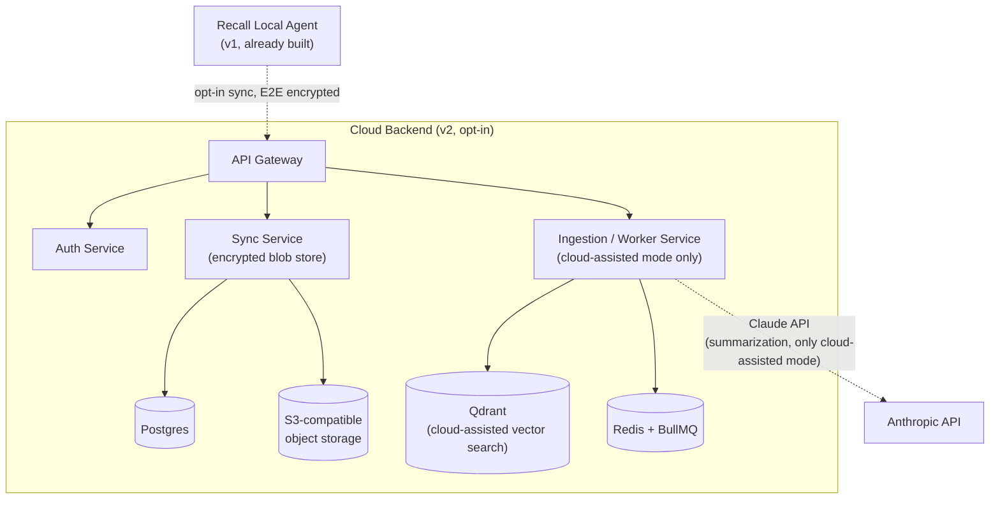

# Recall — v2 Addendum: Cloud Backend, Cloud-Assisted Search & Paid Distribution
## Companion to `recall-prd-and-architecture.md`

**Version:** 1.0
**Status:** Backlog — not scheduled, not started
**Audience:** Same as the main PRD — written to be handed to an AI coding agent once the project is ready to pick this scope back up.

---

## Why this document exists

The main spec ([`recall-prd-and-architecture.md`](./recall-prd-and-architecture.md), v1.2) was revised to make **v1 entirely free to build, run, and distribute** — no cloud hosting bill, no paid third-party API usage, no paid app-store listing fee. Everything that costs real money was pulled out of the v1 roadmap and moved here, unchanged in substance, so:

- v1 stays honestly free and doesn't quietly grow a cost the user didn't sign up for.
- None of the design work already done for this tier is lost — it's fully specified and ready to resume.
- Picking this up later is a deliberate, budgeted decision, not scope creep.

**Everything in this document is deferred.** Do not build any of it as part of the v1 roadmap. Pick it up only when there's an explicit decision to start spending money on hosting/APIs/store fees.

This document assumes the v1 data model (`MemoryEvent`, `Lesson`, `DailyStandup`, `WeeklySummary`, `Settings` — see the main PRD §7) as a fixed foundation. v1 already carries the fields this tier needs (`rev`, tombstones, `tenantId`, `syncOptIns`) specifically so adopting this document later requires no breaking migration of a user's existing local data.

---

## 1. What's deferred, and why each piece costs money

| Deferred item | Real-world cost | Why it's not free |
|---|---|---|
| Cloud backend hosting (auth-service, sync-service) | Monthly hosting bill (Fly.io/Render, then Kubernetes at scale) | Any always-on server needs a host to pay. |
| Managed Postgres | Usage/monthly fee once past a free tier | Backend relational store for accounts, sync cursors, tenant data. |
| Managed Redis + BullMQ workers | Usage/monthly fee once past a free tier | Job queue for the cloud-assisted ingestion pipeline. |
| Qdrant (cloud-assisted search) | Managed Qdrant Cloud fee, or self-hosting cost | Server-side vector index for cross-device search without requiring every device to sync first. |
| Anthropic API (cloud-assisted generation) | Per-token usage cost | Higher-quality `Lesson`/summary generation than a local small model, called only when a user opts in. |
| Chrome Web Store submission | One-time ~$5 developer registration fee | Chrome's extension store charges a one-time account fee (Firefox Add-ons and the VS Code Marketplace do not). |
| S3-compatible object storage | Usage-based fee | Encrypted backup blob storage beyond what fits in the relational store. |

Everything else in the v1 spec — local capture, redaction, Transformers.js embeddings, Ollama (optional, free), the extractive fallback, MCP, VS Code Marketplace publishing, Firefox Add-ons publishing, GitHub Actions CI — has no cost and stays in v1.

---

## 2. Cloud architecture (deferred)

This is the `Cloud Backend` subgraph that was in the v1 spec's §6.2 diagram before the 1.2 revision:

### Component responsibilities

| Component | Responsibility | Runs where |
|---|---|---|
| Cloud API Gateway | Single entrypoint, auth, rate limiting | Cloud |
| Auth Service | Account + device identity, JWT issuance | Cloud |
| Sync Service | Accepts encrypted blobs, manages multi-device merge state | Cloud |
| Ingestion/Worker Service | Cloud-assisted embeddings & summarization (opt-in only) | Cloud, queue-backed workers |

### Sync modes (both opt-in, OFF by default, never conflated)

1. **Encrypted Backup & Multi-Device Merge (default cloud mode, zero-knowledge).** The Local Agent encrypts `MemoryEvent`/`Lesson` blobs client-side (XChaCha20-Poly1305 via libsodium, key derived from a passphrase the user holds — never sent to the server) before upload. The Sync Service stores ciphertext blobs + metadata needed for merge (id, updated_at, device_id, tenant_id) only. The server can never read content. Search across devices still happens locally: each device pulls and decrypts blobs, then indexes them into its own local LanceDB.
2. **Cloud-Assisted Search (explicit second opt-in, non-zero-knowledge).** For users who want server-side semantic search without all devices being online/synced, the Ingestion Service receives plaintext (already redacted) event text, generates embeddings, and stores them in Qdrant server-side, and may call the Anthropic API for higher-quality summarization than the local model can produce. This mode MUST show a one-time explicit warning that content leaves the device, separate from the backup opt-in.

### Merge semantics (both sync modes) — already reflected in the v1 data model

- **Identity & immutability.** `MemoryEvent`s are append-only and immutable once written (their `id` is a ULID, time-sortable). They never conflict; sync is a set-union by `id`.
- **Mutable records** (`Lesson`, settings, tags, `usefulnessScore`, `privacy` flags) use **last-writer-wins keyed on the monotonic `rev` counter** already present on every record, not on wall-clock `updatedAt` (clocks skew across devices). Each mutation increments `rev`; on conflict the higher `rev` wins, ties broken by `deviceId`.
- **Deletes use tombstones**, already implemented locally (`SqliteStore.upsertTombstone`/`getTombstones`, unused by anything until this tier exists). A delete writes a tombstone `{ id, deletedAt, deletedBy }` that propagates like any other record so other devices remove the data on pull. Tombstones carry no payload and are garbage-collected once all known devices have acknowledged the cursor past them.
- **Embedding parity.** Vectors are only comparable if produced by the same model + dimensionality (already recorded per-vector via `embeddingModel`/`embeddingDim`). Local and Cloud-Assisted indexes MUST use the same embedding model and dimension; if they differ, the cloud side re-embeds from `embeddingText` rather than trusting an incompatible vector.

### Threat model additions (only relevant once this tier exists)

| Adversary | Capability | Primary mitigations |
|---|---|---|
| Honest-but-curious cloud (Encrypted Backup mode) | Sees all uploaded blobs + metadata | Client-side XChaCha20-Poly1305; key never transmitted (SEC-5). Server stores ciphertext + merge metadata only. |
| Cloud operator (Cloud-Assisted mode) | Sees post-redaction plaintext the user explicitly chose to send | Out of zero-knowledge scope by design; gated behind a distinct second opt-in (SEC-6) and redaction. |

### Security requirements (renumbered SEC-5/SEC-6 from the main spec)

- **SEC-5:** Zero-knowledge sync mode: the server must be architecturally incapable of reading content — encryption keys are never transmitted. This must be verifiable in code review (no code path sends the passphrase or derived key to any network call).
- **SEC-6:** Cloud-assisted mode requires its own distinct, explicit opt-in screen, separate from the backup opt-in, explaining that plaintext (post-redaction) content is sent to Anthropic/Qdrant for processing.

---

## 3. Cloud Backend API contract (§8.3 from the main spec, moved here)

| Method | Path | Purpose |
|---|---|---|
| POST | `/v1/auth/signup`, `/v1/auth/login` | Account auth (email or OAuth GitHub/Google) |
| POST | `/v1/auth/device/pair` | Register a new device under the account |
| POST | `/v1/sync/push` | Upload encrypted blob batch `{ blobs: [{id, cipherText, updatedAt, deviceId}] }` |
| GET | `/v1/sync/pull?since=` | Pull encrypted blobs changed since cursor |
| POST | `/v1/cloud-search` | Cloud-assisted mode only: plaintext (redacted) query → ranked results |
| GET | `/v1/account` | Account/profile info |

---

## 4. Cloud/paid tech stack

| Layer | Choice | Why |
|---|---|---|
| Cloud-assisted LLM (opt-in only) | Anthropic API (Claude) | Higher-quality summarization when user explicitly opts in and pays for API usage |
| Backend framework | NestJS | Opinionated module structure scales well for AI-assisted scaffolding and keeps service boundaries explicit |
| Backend relational DB | PostgreSQL (via Prisma) | Mature, supports multi-tenant patterns cleanly |
| Cloud vector DB (cloud-assisted mode only) | Qdrant (managed or self-hosted) | Good filtering + horizontal scale story |
| Object storage | S3-compatible (AWS S3 or self-hosted MinIO) | Encrypted blob backups |
| Queue / jobs (cloud) | Redis + BullMQ | Simple, well-understood, good for summarization worker pool |
| Backend deploy (MVP) | Fly.io or Render (containers) | Fast to ship; migrate to Kubernetes only when scale demands it |
| Backend deploy (scale) | Kubernetes | Future-proofing only, Phase 12 |

---

## 5. Roadmap phases (numbered to match the main spec's §13, picked up in order once started)

### Phase 8 — Cloud backend: auth + zero-knowledge sync
- Scaffold NestJS backend with `auth-service` (email + GitHub OAuth, device pairing, JWT) and `sync-service` (push/pull encrypted blobs) modules; Prisma schema with `tenant_id` on every table from day one.
- Implement client-side encryption module (`sync/encryptionClient.ts`) using libsodium; Local Agent setting to enable "Encrypted Backup & Multi-Device Merge."
- Implement the merge engine per §2 above: set-union of immutable `MemoryEvent`s by `id`; last-writer-wins on `rev` (ties by `deviceId`) for mutable records; tombstone propagation for deletes, with tombstone GC once all devices' cursors pass them.
- **DoD:** Two separate local Local Agent instances (simulating two devices) under the same account converge to the same decrypted memory set after push/pull cycles; a record edited concurrently on both devices resolves deterministically to the higher-`rev` version; a delete on one device removes it on the other and does not resurrect on a later pull; server-side inspection of stored blobs confirms ciphertext only (automated test asserts no plaintext substrings from seeded fixtures appear in the DB).

### Phase 9 — Cloud-assisted search (opt-in tier 2)
- Implement `ingestion-service` (BullMQ workers) that accepts redacted plaintext events (only when this mode is explicitly enabled), embeds and stores in Qdrant (collections keyed by `embeddingModel`/`embeddingDim`, re-embedding from `embeddingText` on any model mismatch), and can call the Anthropic API for higher-quality `Lesson`/summary generation.
- Implement `/v1/cloud-search`.
- **DoD:** Enabling cloud-assisted mode shows the required distinct consent screen (SEC-6); disabling it stops new uploads and provides a way to delete previously uploaded plaintext-derived data from Qdrant/Postgres.

### Chrome Web Store submission (part of the main spec's Phase 11, deferred here)
- Chrome Web Store packaging for the browser extension, once the project is ready to pay the one-time ~$5 developer registration fee.
- Everything else needed for this (the MV3 build itself) already exists from v1 — this is purely the store-submission step, not new engineering.

### Phase 12 — Scale-out infra (future, do not build until real load demands it)
- Containerize backend services; move from Fly.io/Render to Kubernetes with HPA on the worker-summarization deployment; managed Postgres (RDS/Neon), managed Redis, Qdrant Cloud.
- This phase is documented here only so the architecture isn't blocked later — no tasks here are in scope until Phase 8/9 are both live and under real load.

---

## 6. Testing strategy additions (once this tier is picked up)

- **Backend contract tests:** OpenAPI schema validation on gateway responses; Prisma migration tests in CI against a throwaway Postgres container.
- **Sync merge tests:** concurrent-edit convergence (higher `rev` wins), delete/tombstone propagation with no resurrection, and ciphertext-only server storage (Phase 8 DoD).
